### Hi there

- 🔭 Student in  [Nanjing University of Aeronautics and Astronautics][1]
- 🌱 I’m currently learning [Torch][2]
- 📫 How to reach me: [Website][3]
- ⚡ Future study: [Unmanned Aerial Vehicles Research Institute][4]

> Currently studying for a master’s degree in `Information and Communication Engineering` from `Nanjing University of Aeronautics and Astronautics`.
>
> Field of research: UAV-based optical target localization and adaptive parameter optimization, UAV track planning.
>
> Companies looking forward to joining: DJI, CASIC, CETC, HUAWEI

### Analytics ⚙️

<table align="center">
  <tr>
    <td align="center">
      
    </td>
    <td align="center">
      
    </td>
  </tr>
  <tr>
    <td align="center">
      
    </td>
    <td align="center">
      
    </td>
  </tr>
  <tr>
    <td align="center">
      
    </td>
    <td align="center">
      
    </td>
  </tr>
</table>

<picture>
  <source media="(prefers-color-scheme: dark)" srcset="./assets/github-snake-dark.svg" />
  <source media="(prefers-color-scheme: light)" srcset="./assets/github-snake.svg" />
  
</picture>

[1]: http://www.nuaa.edu.cn
[2]: https://pytorch.org
[3]: https://www.lingzhicheng.cn
[4]: http://uav.nuaa.edu.cn

### Languages & Tools 🛠

 
  
  
  
  
  
  

 
  
  
  
  
  
  

<!-- markdownlint-disable-file MD033 MD041 -->
